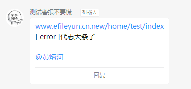

# ding-bot
php plugin for dingtalk robot

## install
```
composer require bingher/ding-bot
```

## use
参考钉钉自定义机器人[接口文档](https://open-doc.dingtalk.com/microapp/serverapi2/qf2nxq)
```
$config = [
    //自定义机器人api接口链接
    'webhook' => 'https://oapi.dingtalk.com/robot/send?access_token=xxxx',
    //签名密钥
    'secret'  => 'ssss',
];
//实例化
$ding = new \bingher\ding\DingBot;

//发送文本消息
$res = $ding->text('hello hello');
$res = $ding->at('18759201163')->at('18698313968')->text('hello hello');
$res = $ding->atAll()->text('hello hello');

//发送链接
$res = $ding->link('电子档案平台','建设工程全过程资料无纸化平台','http://www.efileyun.com','http://www.efileyun.com/Public/images/banner_02.png');


//发送markdown
$res = $ding->markdown(
    '电子档案平台',
    "## 电子档案平台 \n **建设工程**全过程资料无纸化[档案平台](http://www.efileyun.com) \n "
);


//发送actionCard
$res = $ding->singleActionCard('周星驰的龙套生涯','台上一分钟，台下十年功。一点没错。从跑龙套变成星爷','https://v.qq.com/x/page/t09039nicle.html','https://abiko.loli.net/files/2019/07/29/ede7e2b6d13a41ddf9f4bdef84fdc737.png');


//发送actionCard
$res = $ding->makeBtn('周杰伦','http://tags.finance.sina.com.cn/%E5%91%A8%E6%9D%B0%E4%BC%A6')
    ->makeBtn('蔡徐坤','http://tags.finance.sina.com.cn/%E8%94%A1%E5%BE%90%E5%9D%A4')
    ->multiActionCard(
    '微博超话榜',
    "## 微博超话榜 \n在过去前一周里,一群70后、80后、90后的 叔叔阿姨们 ,像打了鸡血一样,为周杰伦发起了一场 打榜之战"
    );


//发送feedCard
$res = $ding->makeLink(
    '这些工种，赚钱多多','https://bh.sb/post/46133/','https://abiko.loli.net/files/2019/07/29/b83aac23b9528732c23cc7352950e880.png')
    ->makeLink('男青年择偶指南','https://bh.sb/post/46123/','https://abiko.loli.net/files/2019/07/28/c8c41c4a18675a74e01c8a20e8a0f662.png')
    ->makeLink('你我所熟知的那个维基百科，出事情了','https://bh.sb/post/46120/','https://abiko.loli.net/thumb/?src=https://dulei.si/files/2019/07/28/006f52e9102a8d3be2fe5614f42ba989.jpeg&w=240&h=180&zc=1')
    ->feedCard();
```
## log driver for thinkphp6
### config
```
# config/log.php
return [
    // 默认日志记录通道
    'default'      => Env::get('log.channel', 'file'),
    // 日志记录级别
    'level'        => [],
    // 日志类型记录的通道 ['error'=>'email',...]
    'type_channel' => ['error'=>'ding',],
    // 是否关闭日志写入
    'close'        => false,
    // 全局日志处理 支持闭包
    'processor'    => null,

    // 日志通道列表
    'channels'     => [
        'file' => [
            // 日志记录方式
            'type'           => 'File',
            // 日志保存目录
            'path'           => '',
            // 单文件日志写入
            'single'         => false,
            // 独立日志级别
            'apart_level'    => [],
            // 最大日志文件数量
            'max_files'      => 0,
            // 使用JSON格式记录
            'json'           => false,
            // 日志处理
            'processor'      => null,
            // 关闭通道日志写入
            'close'          => false,
            // 日志输出格式化
            'format'         => '[%s][%s] %s',
            // 是否实时写入
            'realtime_write' => false,
        ],
        // 其它日志通道配置
        'ding' => [
            // 日志记录方式
            'type'           => '\\bingher\\ding\\DingLog',
            'webhook' => 'https://oapi.dingtalk.com/robot/send?access_token=xxxx', //你申请的钉钉机器人api
            'at' => [], //接收人手机号
            'secret' => '签名密钥',
        ],
    ],

];
```
> 因为钉钉群机器人每分钟最多20条信息,所以建议将error级别的日志使用钉钉来发送,可以及时收到错误提醒
### demo
```
\think\facade\Log::info('有点事情');
\think\facade\Log::notice('有点问题');
\think\facade\Log::error('代志大条了');
```
> 仅error消息会通知到钉钉



